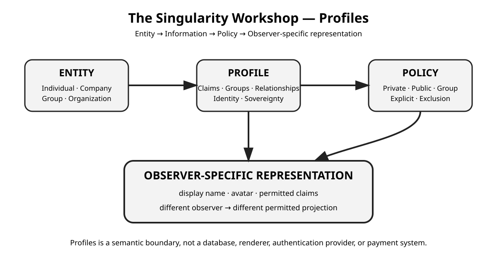

# ✳️ 00 The Singularity Workshop — Profiles

*The same entity can be represented differently to different observers—without confusing identity with what each observer is allowed to see.*

## 🟦 01 The problem—and our response

Applications often mix an entity's identity, private information, public persona, audience rules, and presentation into one application-specific user record. That makes it difficult to reuse concepts across applications—and easy to disclose more information than a particular interaction needs.

**TheSingularityWorkshop.Profiles** is a provider-neutral .NET domain package for describing entities, their claims and relationships, and the information each observer may receive. A person, company, group, organization, experience, agent, or application-defined entity can share this semantic boundary without forcing every application to share the same database, authentication system, or user interface.

> **A Profile is an abstraction of an entity—not a database record, login system, or rendered screen.**

## 🟣 02 Workshop documentation map

Profiles is a reusable domain package within The Singularity Workshop ecosystem. It can be used on its own; neighboring packages and applications may compose it where its contracts are useful. Compatibility is a design opportunity, not a requirement to adopt the entire Workshop.

- **Profiles owns:** entity/profile semantics, claims, disclosure rules, groups, relationships, exclusions, observer-specific representations, assumption results, identity links, exposure metadata, access-record contracts, and opt-in data-licensing policy.
- **The consuming application owns:** persistence, authentication, transport, rendering, verification authority, transaction execution, and jurisdiction-specific decisions.
- **Dependency direction:** infrastructure and experiences may use Profiles; Profiles does not depend on those application-level systems.

The README is the front door. The focused guides linked in section 05 are the deeper authorities. This repository follows the Workshop's shared [Documentation Standard](https://github.com/TrentBest/TheSingularityWorkshop.FSM_COS/blob/development/DOCUMENTATION_STANDARD.md), while keeping Profiles' own domain vocabulary and boundaries.

## 🩵 03 The problem and solution in depth

### One entity, multiple possible representations

A canonical identity answers **“Which entity is this?”** A representation answers **“What may this observer receive?”** They are related, but they are not the same thing.

~~~text
                 ENTITY
                    |
                    v
                 PROFILE
                    |
          claims + relationships
                    |
             disclosure policy
                    |
                    v
       OBSERVER-SPECIFIC REPRESENTATION
       only information this observer may receive
~~~

For example, the same entity may present a public display name to a visitor, a different avatar to a friend, and an anonymous representation to an excluded observer. The representation is a domain-level projection—not merely a UI view model.

### Micro-data: disclose the smallest useful piece

Profiles treats claims as small, independently addressable pieces of information. A consumer that needs a language preference should not automatically need a person's age, memberships, or other attributes. Each claim can have its own disclosure rule.

### Unknown is not false

Experiences often need to ask whether a proposition is satisfied rather than receive the underlying personal value. Profiles distinguishes **Satisfied**, **NotSatisfied**, and **Unknown**. Missing data is not silently treated as proof that a proposition is false. Sensitive or consequential verification still belongs to an appropriately trusted layer.

### Disclosure, verification, and licensing are different

- **Disclosure:** an observer may receive information.
- **Verification:** a proposition has been established to some defined standard.
- **Licensing:** the owner has opted to permit a defined economic use.

None automatically implies the others. A public claim is not automatically for sale; a verified proposition does not necessarily require revealing its underlying value; and a licensing policy does not create a buyer, price, payment, or legal authorization.

### What Profiles deliberately does not own

Profiles is not a database, authentication or identity provider, renderer, communications transport, marketplace, payment processor, accounting system, or legal-compliance engine. Those responsibilities remain outside this package so that applications can compose the infrastructure appropriate to their needs.

## 🟢 04 See it in a minute

Install the package into a .NET 8 project:

~~~bash
dotnet add package TheSingularityWorkshop.Profiles
~~~

The following is a **source-shaped example** of the intended flow; consult the consuming guide for full setup, prerequisites, and examples.

~~~csharp
var language = ProfileAttributeDefinition.Create(
    "language",
    typeof(string),
    "Preferred language.");

var profile = new Profile(ProfileEntityKind.Individual, "Ari")
    .SetClaim(new ProfileClaim(language, "en-US"))
    .SetDisclosureRule(
        new DisclosureRule("language", DisclosureScope.Public));

var observerId = ProfileId.New();
var representation = profile.RepresentTo(observerId);
~~~

In plain language: create an entity profile, add one small claim, declare the audience allowed to receive it, then request the observer-specific representation. Configuration methods return the profile so related setup can be chained, while the disclosure decision remains explicit and visible. The important step is not merely storing a value—it is making the disclosure boundary explicit.

**Expected behavior:** the returned representation is the observer-facing projection governed by the profile's disclosure and exclusion rules. Do not pass the complete Profile to an untrusted renderer or remote consumer when it only needs the representation.

## 🟪 05 Documentation and theory

- [Consuming Profiles](docs/CONSUMING.md) — installation, common tasks, and examples for integrating the package into an application.
- [How-to guide](docs/HOW_TO.md) — task-oriented recipes for common profile operations.
- [Theory](docs/THEORY.md) — the mental model behind entity abstraction, micro-data, identity sovereignty, and observer-specific disclosure.
- [Architecture](docs/ARCHITECTURE.md) — responsibility boundaries, dependency direction, and the package's integration seams.
- [Privacy model](docs/PRIVACY.md) — the privacy principles and distinctions the domain is designed to represent; not a legal-compliance guarantee.
- [API map](docs/API.md) — a conceptual guide to the public types; XML API documentation remains authoritative for member-level details.
- [Publishing and package metadata](docs/PUBLISHING.md) — package/release preparation information.

## Domain vocabulary at a glance

| Concept | Responsibility |
|---|---|
| Entity / Profile | The entity's domain boundary |
| Claim | One piece of typed information |
| Disclosure rule | Which audience may receive a claim |
| Group / relationship | Audience membership and semantic links |
| Representation | Observer-specific, permitted projection |
| Assumption | A proposition with Satisfied, NotSatisfied, or Unknown result |
| Identity link | A private link between profiles, for trusted infrastructure |
| External identity binding | A provider-qualified reference mapped to a profile by trusted authentication integration |
| Access record | A minimal event for application-owned transparency/audit |
| Data-license policy | An opt-in allow-list; not a transaction |

## Ecosystem fit

Profiles is designed to remain independently useful. Workshop applications may use it as shared domain vocabulary, while retaining freedom to choose their own storage, policy enforcement, verification providers, and presentation systems. Profiles does not require FSM_COS or an application host, and it does not turn every profile into a runtime bundle.

### Coexistence with HeadlessAi

[TheSingularityWorkshop.HeadlessAi](https://github.com/TrentBest/TheSingularityWorkshop.HeadlessAi) is a separate, headless agent runtime. Profiles can describe an agent's domain identity or provide a carefully filtered representation of its persona; HeadlessAi does not need Profiles as a core dependency. A host may compose both packages and decide which profile context an agent receives. Neither a profile claim nor an external identity binding grants permission to invoke tools, access data, or perform actions. The host or dedicated security layer must authenticate, authorize, and enforce those decisions.

## Package status and boundaries

- **Package:** TheSingularityWorkshop.Profiles
- **Target framework:** .NET 8
- **Current source package version:** 0.1.0-alpha.1 (confirm the published feed before relying on package availability)
- XML documentation is enabled; warnings are treated as errors.
- The README includes live links for license, NuGet version/downloads, build status, last commit, and Codecov coverage.
- The package is not a legal-compliance certificate or a guarantee that a consuming application's policies satisfy any jurisdiction.

NuGet publication remains an explicit release action; documentation or CI changes do not authorize a release.

---

[GitHub — Profiles](https://github.com/TrentBest/Profiles)

**The Singularity Workshop — Tools for the curious, the bold, and the systemically inclined.**
